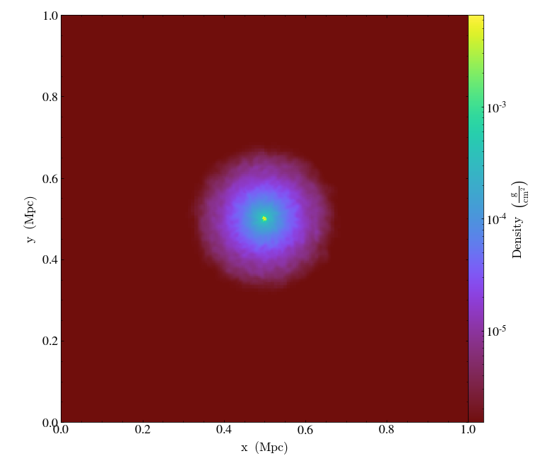
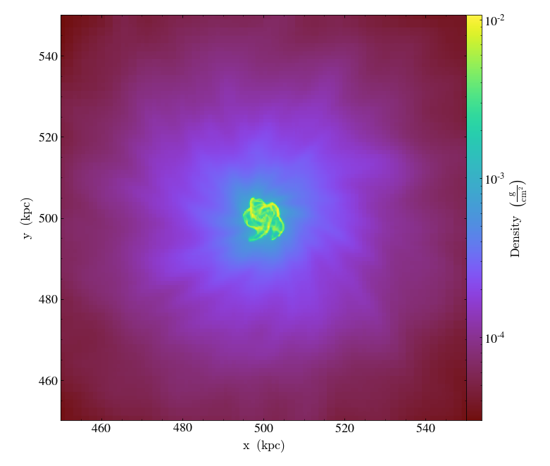
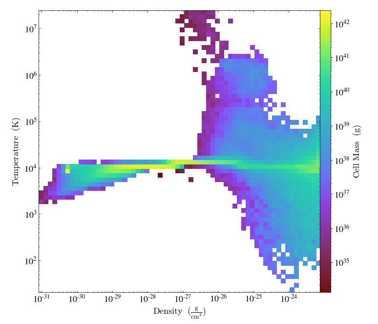

<!-- .slide: class="titleslide" -->

# Intro to yt

## Matthew Turk

<p data-markdown=true><tt>matthewturk@gmail.com</tt></p>

---

# Hi.

<p class="fragment">I'd like to just take a minute to say how grateful I am to
have this opportunity to share this workshop with you, and that we all have the
ability to be here and to be "present" for this experience.</p>

---

## Credits: `yt`

`yt` is a community of users and developers.  The steering committee is made up of:

 * Britton Smith
 * Madicken Munk
 * John ZuHone
 * Stephanie Tonnesen
 * Nathan Goldbaum
 * Matthew Turk
 * Cameron Hummels

Two additional folks who have bene extremely active lately I'd like to
recognize are Clément Robert and Corentin Cadiou.

---

<div style="width: 640px; padding-top:5em;" data-markdown=true>
<h1>We tell lies to visualize.</h1>

<h3 style="text-align:right;">&mdash; Stuart Levy</h3>
</div>

---

<div class="fig-container" data-file="/2020-10-26-visastro-grammar-of-analysis/figures/decoding.html" data-markdown=true>
</div>

---

<!--.slide: data-background-image="https://www.nasa.gov/sites/default/files/thumbnails/image/orion-nebula-xlarge_web.jpg" 
            data-background-size="cover" data-background-repeat="none" -->

---

<div class="fig-container" data-file="/2020-10-26-visastro-grammar-of-analysis/figures/orion_light.html" data-markdown=true>
</div>

---

<!-- .slide: data-background-image="/2020-10-26-visastro-grammar-of-analysis/images/clouds.jpg"
             data-background-size="cover" data-background-repeat="none" -->

---

<!-- .slide: data-background-image="https://upload.wikimedia.org/wikipedia/commons/b/bd/Kelvin_Helmholz_wave_clouds.jpg"
             data-background-size="cover" data-background-repeat="none" class="full" -->

<div class="multiCol">
<div class="col" data-markdown=true>
</div>
<div class="col fragment fade-in" style="opacity:0.7;background-color: white;" data-markdown=true>
$$\begin{aligned}{\partial \rho  \over \partial t}+\nabla \cdot (\rho \mathbf{v}) &= 0\\
{\frac {\partial \mathbf {v} }{\partial t}}+\mathbf {v} \cdot \nabla \mathbf {v} +{\frac {\nabla p}{\rho }}&=\mathbf {g}\\
{\partial e \over \partial t}+\mathbf {v} \cdot \nabla e+{\frac {p}{\rho }}\nabla \cdot \mathbf {v} &=0\end{aligned}$$
</div>
</div>

<!--<p class="mediumtext centered"><a href="https://commons.wikimedia.org/wiki/File:Kelvin_Helmholz_wave_clouds.jpg">Brocken Inaglory [CC BY-SA 4.0], via Wikimedia Commons</a></p> -->

---

<div class="multiCol">
<div class="col">
<div class="fig-container" data-style="height: 600px;" data-file="/2020-10-26-visastro-grammar-of-analysis/figures/kh_example.html" data-markdown=true>
</div>
</div>
<div class="col" data-markdown=true>
$$\begin{aligned}{\partial \rho  \over \partial t}+\nabla \cdot (\rho \mathbf{v}) &= 0\\
{\frac {\partial \mathbf {v} }{\partial t}}+\mathbf {v} \cdot \nabla \mathbf {v} +{\frac {\nabla p}{\rho }}&=\mathbf {g}\\
{\partial e \over \partial t}+\mathbf {v} \cdot \nabla e+{\frac {p}{\rho }}\nabla \cdot \mathbf {v} &=0\end{aligned}$$
</div>
</div>

---


# Vocabulary of Data Analysis

<div class="appearing_row" style="margin-top: 1em;">
  <div class="fragment" data-fragment-index=1>
  <div class="right_align">
    <span><i class="fas fa-align-right fa-5x"></i></span>
  </div>
  </div>
  <div class="fragment" data-fragment-index=1>
  <div class="left_align" style="font-size: 200%;">
    Registration
  </div>
  </div>
</div>

<br clear="all"/>

<div class="appearing_row" style="margin-top: 1em;">
  <div class="fragment" data-fragment-index=2>
  <div class="right_align">
    <span><i class="fas fa-calculator fa-5x"></i></span>
  </div>
  </div>
  <div class="fragment" data-fragment-index=2>
  <div class="left_align" style="font-size: 200%;">
    Transformation
  </div>
  </div>
</div>

<br clear="all"/>

<div class="appearing_row" style="margin-top: 1em;">
  <div class="fragment" data-fragment-index=3>
  <div class="right_align">
    <span><i class="fas fa-object-group fa-5x"></i></span>
  </div>
  </div>
  <div class="fragment" data-fragment-index=3>
  <div class="left_align" style="font-size: 200%;">
    Selection
  </div>
  </div>
</div>

<br clear="all"/>

<div class="appearing_row" style="margin-top: 1em;">
  <div class="fragment" data-fragment-index=4>
  <div class="right_align">
    <span><i class="fas fa-mortar-pestle fa-5x"></i></span>
  </div>
  <div class="fragment" data-fragment-index=4>
  <div class="left_align" style="font-size: 200%;">
    Reduction
  </div>
  </div>
</div>

<br clear="all"/>

---

<div class="multiCol">
<div class="col">

# Registration

<p class="fragment">Data is laid out on <b>disk</b> in some manner that may or may not correspond to the spatial organization or physical meaning of what it represents.</p>

<p class="fragment">This data can be laid out in a data structure in <b>memory</b> that represents its logical ordering, with axes and dimensions.</p>

<p class="fragment">Finally, we can register one or multiple datasets in a consistent <b>spatial</b> representation so that we can query fields at specific locations and define $f(\mathbf{x})$.</p>

</div>

<div class="col">
<div class="fig-container" data-file="/2020-10-26-visastro-grammar-of-analysis/figures/volume_layout.html" data-preload data-style="height: 600px;">
</div>
</div>
</div>

---

<div class="multiCol">
<div class="col">

# Registration

<p class="fragment">Given a functional form, discretely sampled data can also be registered for analysis, regardless of its layout on disk.</p>

<div class="fragment" data-markdown=true>
<p>This data may carry with it attributes regarding the density of samples, its neighbors, and fundamental quantities, which can be input into a sampling function over a location.</p>

`$$ A(\mathbf{r}) = \int A(\mathbf{r}')W(|\mathbf{r} - \mathbf{r}'|, h)\mathrm{d} V(\mathbf{r}') $$`
</div>

</div>

<div class="col">
<div class="fig-container" data-file="/2020-10-26-visastro-grammar-of-analysis/figures/particle_layout.html" data-preload data-style="height: 600px;">
</div>
</div>
</div>


---

<div class="multiCol">
<div class="col">
<div class="fig-container" data-file="/2020-10-26-visastro-grammar-of-analysis/figures/galaxy_transformations.html" data-preload data-style="height: 768px;">
</div>
</div>
<div class="col" data-markdown=true>

# Transformations

<p class="fragment">"Primitive" variables: $\rho, \mathbf{v}, e, ...$ can be combined in many different ways to produce fields that exist <i>in potentia</i>.</p>
<p class="fragment">Registration enables combinations at fixed spatial locations.</p>
<p class="fragment">For example, we can apply the arithmetic manipulation:
$$|v| = \sqrt{v_x^2 + v_y^2}$$
</p>
</div>
</div>

---

<div class="multiCol">
<div class="col" data-markdown=true>

# Selection

<p>Points can be filtered based on their connectivity, spatial organization, or criteria from one or more field values.</p>
</div>
<div class="col">
<div class="fig-container" data-file="/2020-10-26-visastro-grammar-of-analysis/figures/kh_operations.html" data-preload data-style="height: 768px;">
</div>
</div>
</div>

---

# Reductions

We can apply reductions along axes, paths and non-trivial manifolds.

<div class="fig-container" data-file="/2020-10-26-visastro-grammar-of-analysis/figures/kh_path.html" data-preload data-style="height: 600px;">
</div>

---

# Composability

<div class="fig-container" data-file="/2020-10-26-visastro-grammar-of-analysis/figures/cosmology.html" data-preload data-style="width: 900px;">

---

# Volumetric Analysis Platform

<div class="multiCol">
<div class="col">

</div>
<div class="col">

The `yt` platform for analysis is a mechanism for abstracting the underlying
operations and building reproducible analysis procedures, independent of data
representation and distribution.  `yt` supports a couple dozen data formats,
from the very big to the very small.

[yt-project.org](https://yt-project.org/)

</div>
</div>

---

# Volumetric Analysis Platform

Data-format independent analysis and visualization.


From left, these are GAMER-2, AREPO and GIZMO data outputs, each utilizing different discretization and data ingestion mechanisms.  Image courtesy John ZuHone.

---

yt is less a visualization engine than a set of components for constructing the **inputs** to visualization engines.

Let's think about three potential categories of visualization: <!-- .element: class="fragment" data-fragment-index="1" -->

<div class="multiCol">
    <div class="col">
        <ul>
            <li class="fragment" data-fragment-index="2">Visualizations we make for ourselves</li>
            <li class="fragment" data-fragment-index="3">Visualizations we make for our peers</li>
            <li class="fragment" data-fragment-index="4">Visualizations we make for everyone else</li>
        </ul>
    </div>
    <div class="col">
        <ul>
            <li class="fragment" data-fragment-index="2" style="list-style-type:none;">(Our excellent adventure)</li>
            <li class="fragment" data-fragment-index="3" style="list-style-type:none;">(A bogus journey)</li>
            <li class="fragment" data-fragment-index="4" style="list-style-type:none;">(Time to face the music)</li>
        </ul>
    </div>
</div>

<div class="fragment" data-fragment-index="5">

Each of these brings with it different needs for **narrative**, for
**interactivity**, for **control** and for the **visual language** we use to convey
information.

</div>

<div class="fragment" data-fragment-index="5">

So let's take a look at some of the most common things we do in yt.

</div>


---

## "Seeing" the data

<div class="multiCol">
<div class="col">

```python
ds = yt.load_sample("IsolatedGalaxy")
p = ds.r[:].integrate("density", axis="z").plot()
```

<p class="fragment" data-fragment-index="2">
But, what is happening?
</p>

<ol>
<li class="fragment">Data is selected</li>
<li class="fragment">Index is collapsed into a quadtree</li>
<li class="fragment">Data is chunk-by-chunk loaded and applied to quadtree</li>
<li class="fragment">Quadtree is used to create 2D data value buffer</li>
<li class="fragment">Data values passed to matplotlib</li>

</div>
<div class="col">

<!-- .element: class="fragment" data-fragment-index="1" -->

</div>
</div>

---

## "Seeing" the data

<div class="multiCol">
<div class="col">

```python
p.zoom(10)
```

<p class="fragment" data-fragment-index="2">
What has to happen this time?
</p>

<ol class="fragment">
<li><del>Data is selected</del></li>
<li><del>Index is collapsed into a quadtree</del></li>
<li><del>Data is chunk-by-chunk loaded and applied to quadtree</del></li>
<li>Quadtree is used to create 2D data value buffer</li>
<li>Data values passed to matplotlib</li>

</div>
<div class="col">

<!-- .element: class="fragment" data-fragment-index="1" -->

</div>
</div>

---

## "Exploring" the data

<div class="multiCol">
    <div class="col">

```python
ds = yt.load_sample("IsolatedGalaxy")
ds.r[(0.4,'Mpc'):0.6,:,:].profile(
    ["density", "temperature"],
    "cell_mass",
    weight_field=None).plot()
```

<p class="fragment" data-fragment-index="2">

But, again, what is <i>actually</i> happening?

</p>

<ol>
    <li class="fragment">Data is selected</li>
    <li class="fragment">Bounds are computed (optional)</li>
    <li class="fragment">Data is loaded and placed into bins</li>
    <li class="fragment">Bins and bounds are passed to matplotlib as 2D data value buffer</li>
</ol>


</div>
<div class="col">

<!-- .element: class="fragment" data-fragment-index="1" -->

</div>
</div>

---

## Let's dig in!

---

## Thank you!

And please fill out the survey:

http://bit.ly/3sB2PcMytWorkshop
